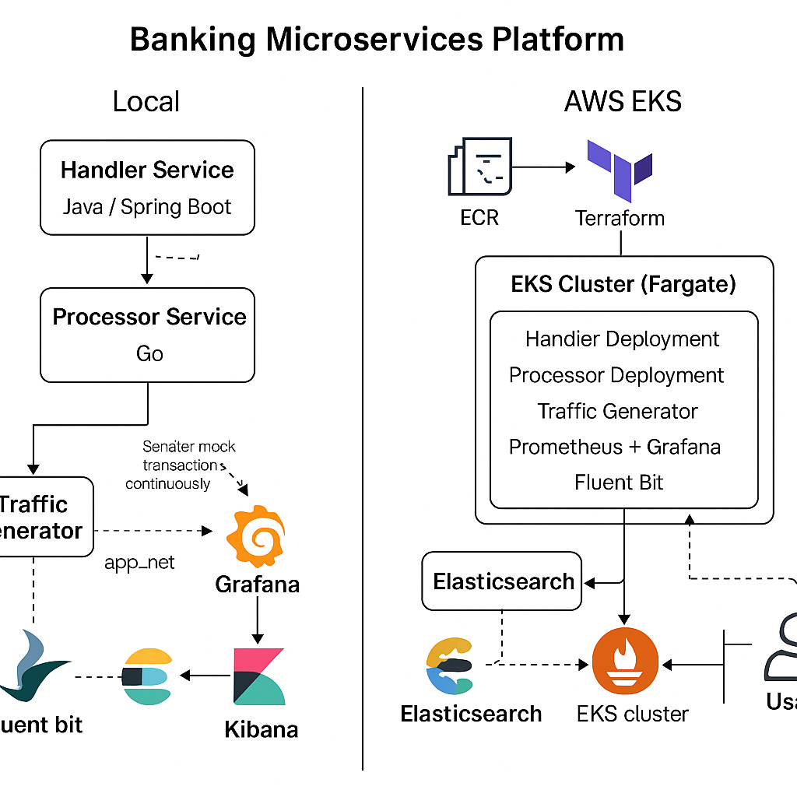

# 💳 Banking Microservices Platform using AWS EKS and DevOps Tools



## 📘 Overview
A **cloud-native microservices banking platform** demonstrating end-to-end DevOps practices — containerization, orchestration, observability, and IaC on AWS.

**Author:** Sindhu Telikapalli  
**Role:** DevOps / Cloud Engineer / SRE  
**Tech Stack:** Docker · Kubernetes (EKS) · Terraform · Prometheus · Grafana · Fluent Bit · ELK

---

## 🚀 Architecture Summary
- **Handler Service** – Accepts and routes transaction requests.  
- **Processor Service** – Processes transactions (OK/NOK) and writes structured logs.  
- **Traffic Generator** – Simulates live payment traffic.  
- **Prometheus & Grafana** – Monitoring, alerting, and visualization.  
- **Fluent Bit + Elasticsearch + Kibana (EFK)** – Centralized logging and analysis.  
- **Terraform + AWS EKS (Fargate)** – Infrastructure as Code for secure and scalable deployment.

---

## 🧩 Deployment Phases

| Phase | Description | Tools |
|-------|--------------|-------|
| **1** | Build and push Docker images to AWS ECR | Docker, AWS ECR |
| **2** | Provision EKS + Fargate cluster via IaC | Terraform, AWS |
| **3** | Deploy services and simulate traffic | kubectl, YAML |
| **4** | Integrate monitoring & alerting | Prometheus, Grafana |
| **5** | Implement centralized logging | Fluent Bit, Elasticsearch, Kibana |

> **Note:** The ECR image URLs in Kubernetes manifests are placeholders.  
> Replace them with your own AWS ECR repository URIs before deployment.

---

## 📊 Monitoring & Logging
- **Prometheus** – Scrapes metrics from handler and processor endpoints.  
- **Grafana** – Displays dashboards for uptime and transaction status.  
- **Fluent Bit** – Streams logs from `/var/log/myapp` into Elasticsearch.  
- **Kibana** – Visualizes indexed logs for debugging and observability.  

---

## 🌐 Highlights
✅ Fully automated provisioning using **Terraform**  
✅ **Dockerized microservices** built and deployed on EKS Fargate  
✅ Real-time synthetic load generation with **Traffic Generator**  
✅ Integrated **Prometheus + Grafana** dashboards  
✅ Centralized log pipeline with **Fluent Bit + Elasticsearch + Kibana**

---
⚙️ Setup Modes

🧪 Local Environment (Docker Compose)
	1.	Build and start all services
    
    docker compose up -d --build

  2.	Access:
	•	Handler Service: http://localhost:9191
	•	Processor Service: http://localhost:9190
	•	Prometheus: http://localhost:9095
	•	Grafana: http://localhost:3000
	•	Kibana: http://localhost:5601

☁️ Cloud Deployment (AWS EKS via Terraform)

  1.	Navigate to the infra directory
     ```bash
     cd infra
     terraform init
     terraform apply

	2.	Deploy services
      ```bash
      kubectl apply -f K8s/

  3.	Verify
      ```bash
      kubectl get pods -n banking
      kubectl get svc -n banking
    
📝 Note: The AWS EKS cluster and ECR repositories used for this demo were later destroyed to avoid costs.
You can recreate them easily using the included Terraform templates.
⸻
🔍 Monitoring & Logging

Prometheus + Grafana
	•	Prometheus scrapes metrics from:
	•	/actuator/prometheus (Handler)
	•	/metrics (Processor)
	•	Grafana imports dashboards and visualizes metrics & alerts.

Fluent Bit + ELK
	•	Fluent Bit tails logs from /var/log/myapp/* and ships them to Elasticsearch.
	•	Kibana visualizes the logs using the index pattern logstash-*.

    ```bash
    docker ps
    docker logs -f fluentbit

    # List targets scraped by Prometheus
    curl -s http://localhost:9095/api/v1/targets | jq '.data.activeTargets[].labels.job'

    # Check Grafana dashboards
    http://localhost:3000
⸻

🚀 Outcome

✅ Fully automated microservices banking app
✅ Observable with real-time metrics and logs
✅ Infrastructure as Code via Terraform
✅ Demonstrates end-to-end DevOps workflow — from code → build → deploy → monitor


⸻


## 🏁 Next Steps
- Integrate CI/CD with GitHub Actions or Jenkins.  
- Add **Dapr** sidecars for resilience and observability.  
- Extend deployment to **multi-region EKS clusters**.

---

### 👩‍💻 Author
**Sindhu Telikapalli**  
DevOps · Cloud Engineer · SRE  
